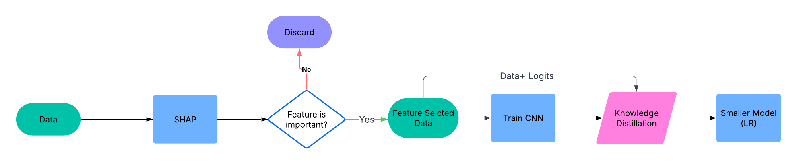

# 🔒 TinyGuard

🛡️ **Ultra-light (0.05KB) CNN model for detecting compromised IoT devices**, distilled for edge efficiency using Knowledge Distillation.

---

## 🚀 Overview

**TinyGuard** is a hyper-optimized deep learning model designed to run on ultra-resource-constrained IoT environments. Leveraging **Knowledge Distillation**, we compress a powerful CNN into a **tiny 0.05KB model**—without sacrificing its ability to detect compromised or anomalous device behavior.

This project showcases how *security* and *efficiency* can co-exist on the edge.

---
## 🔄 Workflow

---

## What is Knowledge Distillation?

**Knowledge Distillation** is a model compression technique where a small "student" model is trained to mimic the behavior of a large "teacher" model. Instead of learning from raw labels, the student learns from the teacher’s **soft predictions**—capturing richer patterns and decision boundaries.

This technique enables us to:
- Retain much of the performance of large models
- Deploy models in extremely constrained environments (like IoT, microcontrollers)
- Improve inference time, energy consumption, and memory footprint

📖 **Read more**: [Distilling the Knowledge in a Neural Network (Hinton et al., 2015)](https://arxiv.org/abs/1503.02531)

---

## 📁 Project Structure

* [TinyGuard](./)
  * [Base-Papers](./Base-Papers)  
    * [base_paper_2.pdf](./Base-Papers/base_paper_2.pdf) – Paper on energy use in on-device ML for IoT intrusion detection
  * [Report-PPT](./Report-PPT) – Final project report and presentation
  * [results](./results) – Output graphs, logs, and final results
  * [README.md](README.md) – This file
